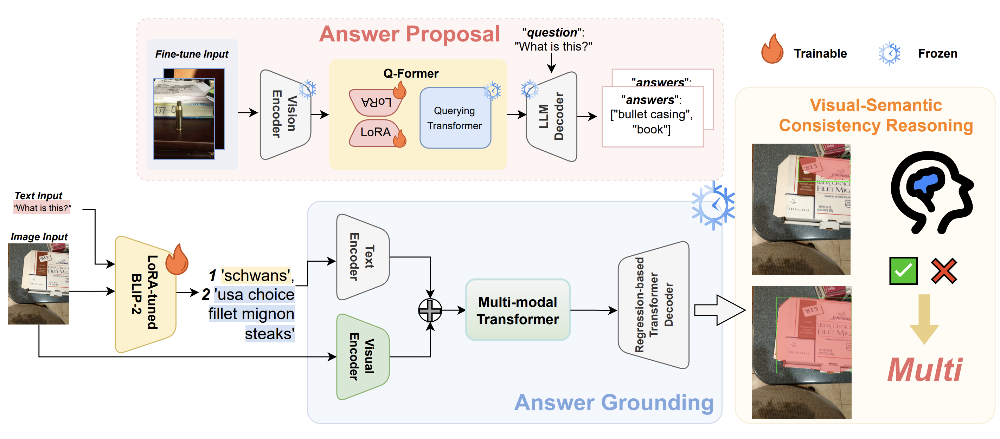

# BLaVe-CoT: Consistency-Aware Visual Question Answering for Blind and Low Vision Users

## Introduction🚀

**BLaVe-CoT** is a Visual Question Answering (VQA) framework designed to assist **Blind and Low Vision (BLV)** users by addressing challenges posed by ambiguous visual questions and noisy image data. Unlike conventional VQA systems, which assume a single answer and corresponding image region, **BLaVe-CoT** generates multiple candidate answers and uses visual grounding to determine their relevance to different regions in the image. A **Chain-of-Thought (CoT)** reasoning module is applied to assess answer consistency in the face of ambiguity. Evaluated on the **VQA-AnswerTherapy** benchmark, **BLaVe-CoT** demonstrates superior robustness to ambiguity and visual noise, making it well-suited for assistive applications. 🌟



## Installation 💻

To run **BLaVe-CoT**, make sure you have Python 3.8 or higher installed and then follow these steps:

```bash
git clone https://github.com/Accecwan/BLaVe-CoT.git
cd BLaVe-CoT
pip install -r requirements.txt
```

## Preparation 🛠️

### 1.Dataset
This framework relies on the [VQA-AnswerTherapy](https://vizwiz.org/tasks-and-datasets/vqa-answer-therapy/) dataset, which contains image-question pairs for BLV users. 

The dataset should be structured as follows:
```pgsql
BLaVe-CoT/VQA-init/dataset/
    ├── VizWiz-VQA-train/   
    ├── VizWiz-VQA-test/
        ├── images/
        ├── VizWiz-VQA-test.json
```
Make sure to update the paths in the script accordingly, pointing to where you saved the dataset.

### 2.Models
The framework uses the following models for visual question answering:

1. **BLIP-2 Model:** This is the base model used for answering questions. You can download the original pre-trained [blip2-opt-2.7b](https://huggingface.co/Salesforce/blip2-opt-2.7b) model from Hugging Face, and obtain the LoRA fine-tuned BLIP-2 model from [Lora-BLIP2](https://pan.baidu.com/s/1iSaezH5KvSq91BLcCD212w?pwd=uhvc).

2. **PolyFormer:** This model is used for spatially grounding the answers to specific regions in the image. You can download the pre-trained [PolyFormer](https://drive.google.com/file/d/1lUCv7dUPctEz4vEpPr7aI8A8ZmfYCB8y/view) model.

3. **all-MiniLM-L6-v2 Model:** This model is used for evaluating semantic similarity between generated answers. You can download the [all-MiniLM-L6-v2](https://huggingface.co/sentence-transformers/all-MiniLM-L6-v2) model from Hugging Face.

Ensure you have these models downloaded and placed in the appropriate directories before running the system.

## Running 🚀

### 1.inference
To run inference on the dataset, execute the `inference_VizWiz.py` script. This will process each image-question pair, generate answers, and apply visual grounding.

```bash
python inference_VizWiz.py --model ./models/polyformer_l_refcoco+.pt --output ./output
```

### 2.Evaluate
To evaluate the framework's performance, run the `evaluate_vizwiz.py` script. This will evaluate the generated answers on the VQA-AnswerTherapy benchmark.
```bash
python evaluate_vizwiz.py
```

## Acknowledgement 🙏
BLaVe-CoT is built with reference to the code of the following projects:[VizWiz2024-VQA-AnswerTherapy](https://github.com/daitranskku/VizWiz2024-VQA-AnswerTherapy/tree/main)

## License 📝
This project is licensed under the MIT License.
